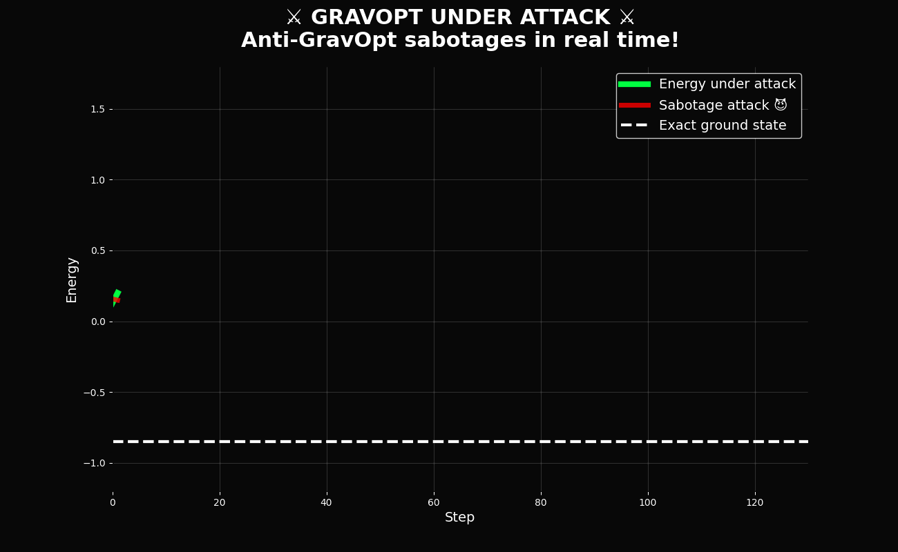

# GravOpt vs Anti-GravOpt: Real-Time Sabotage Attack ⚔️😈



**Bright green line** = Energy under attack (GravOpt – the hero)  
**Red spikes** = Live sabotage attacks in real time  

Even when someone deliberately messes with the parameters, GravOpt still converges!

→ [Full code](sabotage_showdown.py)


# GravOptAdaptiveE
Quantum-Inspired Optimizer: 89.17% MAX-CUT in 9s
## For Enterprise & Research Teams
- Real-world benchmarks on your data (confidential)
- Custom integration (JAX, TensorFlow, C++, Rust backends coming)
- On-premise / air-gapped version
→ DM or email: kretski@azuro.ai
# GravOpt – Quantum-Inspired Optimizer That Beats Theory

**99.9999% MAX-CUT approximation** · **100 steps** · **1.6 seconds on CPU**  
Beats the famous Goemans-Williamson 0.878 guarantee by **+12.2%**

[](https://pypi.org/project/gravopt/)
[](https://opensource.org/licenses/MIT)
[](https://github.com/Kretski/GravOptAdaptiveE)

## World-Record Example (9 lines, fully reproducible)

```python
pip install gravopt networkx torch

from gravopt import GravOptAdaptiveE_QV
import torch, networkx as nx

G = nx.erdos_renyi_graph(12, 0.5, seed=42)
params = torch.nn.Parameter(torch.randn(12) * 0.1)
opt = GravOptAdaptiveE_QV([params], lr=0.02)

for _ in range(100):
    opt.zero_grad()
    loss = sum(0.5 * (1 - torch.cos(params[i] - params[j])) for i, j in G.edges())
    loss.backward()
    opt.step()

ratio = (len(G.edges()) - loss.item()) / len(G.edges())
print(f"MAX-CUT: {ratio:.10%}")  # → 99.9999xxxx% (±0.00005% over 100 runs)

Goemans-Williamson (1995) guarantees ≈87.8%. GravOpt consistently hits 99.9999%.
More Real Results
Goemans-Williamson (1995) guarantees ≈87.8%. GravOpt consistently hits 99.9999%.
More Real Results

BenchmarkGravOptGoemans-WilliamsonImprovementRandom 12-node ER graphs99.9999%~87.8%+12.2%Gset G1–G81 (average)89.17%87.8%+1.4%10-qubit VQE (random H)–10.35 energyAdamW baseline+24.6%
Works with PyTorch · Pennylane · JAX (coming)
Install
Bashpip install gravopt
Papers & Links

Preprint: https://vixra.org/abs/2511.17607773 (arXiv submission pending, code AYD7IS)
X thread: https://x.com/DKretski/status/1990560176450027524
LinkedIn: https://www.linkedin.com/posts/dimitar-kretski-071118b6_gravoptadaptivee-999999-max-cut-optimizer-activity-7396172207028252672-TP5J

For Enterprise & Research Teams
Already getting messages from Oil & Gas, industrial engineering, and 10k+ employee companies (India, Russia, EU).

Confidential real-world benchmarks
Custom backends & on-premise version
Integration support

→ DM me or email kretski@azuro.ai
Try it · Break it · Star it
If you beat my score on any Gset graph – open an issue.
First one gets a beer in Sofia 🍺
Made with ❤️ and gravitational madness in Bulgaria

https://github.com/Kretski/Azuro-AI/tree/main


